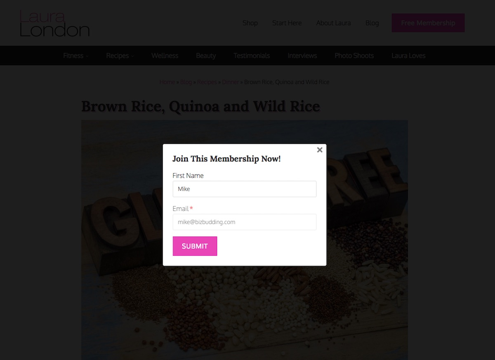
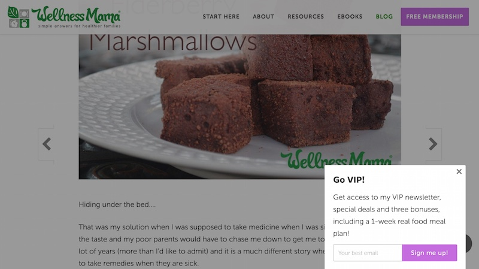

# Wampum Popups
A lightweight but flexible WordPress popups plugin utilizing [oiubounce](https://github.com/carlsednaoui/ouibounce).
* Use a simple shortcode (or PHP function) to create 1 or more popups (or slideups) throughout your website
* Popup types include exit itent, timed, link, and button
* Automatically works with WordPress galleries (when set to link to file or attachment page)
* Default exit intent and timed popups store an expiring cookie in the browser so it won't continue to display after a user closes it
* Various options allow fine-tuning (see below)
* Easy plugin updates in the WordPress Dashboard via [GitHub Updater plugin](https://github.com/afragen/github-updater)





## Basic Usage
Tip: A browser extention like [Cookie Inspector](https://chrome.google.com/webstore/detail/cookie-inspector/jgbbilmfbammlbbhmmgaagdkbkepnijn) is helpful as it lets you manually clear individual cookies 1 at a time

### Shortcode

```
[wampum_popup type="exit" style="modal"] // HTML content here [/wampum_popup]
```

#### Manually launch a popup with a link/button in the WP editor

```
[wampum_popup type="link" text="Click Here"] // HTML content here [/wampum_popup]
```
```
[wampum_popup type="button" text="Click Here"] // HTML content here [/wampum_popup]
```

### PHP functions

Use the `wampum_popups` hook to safely output a popup. This way, if the plugin gets deactivated your popup won't throw errors and/or break your site

```
add_action( 'wampum_popups', 'prefix_do_wampum_popup' );
function prefix_do_wampum_popup() {

	// Bail if not a single post
	if ( ! is_singular('post') ) {
		return;
	}

	$content = '// Some HTML';

	$args = array(
		'type'	=> 'timed',
		'style'	=> 'slideup',
	);
	wampum_popup( $content, $args );

}
```
Optionally use `get_wampum_popup( $content, $args );` to return the popup

**Note:** Scripts will already be enqueued

#### Manually launch a popup with a link/button in your PHP template

```
$content = '// Some HTML';
$args	 = array(
	'type'	=> 'link', (or 'button')
	'text'	=> 'Click Here',
);
wampum_popup_link( $content, $args );
```

Optionally use `get_wampum_popup_link( $content, $args );` to return the link

**Note:** Scripts will already be enqueued and popup will be loaded in the DOM

### WordPress Galleries

Create a gallery and "Link To" either "Attachment Page" (not sure why anyone would ever do this) or "Media File".

Wampum Popups filters the attachement image or permalink URL and uses the 'large' image size in place.

## Shortcode parameters & PHP args

### type (**required**)

(string) 'exit|timed|link|button'

**Default** `null`

Type of popup. This is the only required parameter.

**Note:** 'exit' and 'timed' should be used with `wampum_popup()` hooked into `wampum_popups` action hook, while 'link' and 'button' should be used with `wampum_popup_link()` in your template, functions.php, etc..

---

### close_button

(boolean) true|false

**Default** `true`

Show the close button

---

### close_outside

(boolean) true|false

**Default** `true`

Close popup by clicking outside the modal

---

### style

(string) 'modal|slideup'

**Default** `'modal'`

Style of the popup

---

### text

(string) 'Click Here'

**Default** `null`

The link/button text when using `wampum_popup_link()` function

---

### time

(integer) 4000

**Default** `4000`

Time in milliseconds. 4000ms = 4s

---

### logged_in and logged_out

**Note:** if logged_in and logged_out are both true, the popup will never load... naturally

#### logged_in

(boolean) true|false

**Default** `false`

Show only to logged in users

#### logged_out

(boolean) true|false

**Default** `false`

Show only to logged out users

---

### width

(string) '400px|auto|calc(100vw - 5%)''

**Default** `'400px'`

Max width of the popup, formatted for CSS `max-width: 400px;` spec. Helps for custom designs, larger images, videos, or to make slideups not so weird if too big.

---

## ouibounce args

These args are specific to the [oiubounce](https://github.com/carlsednaoui/ouibounce) script

Most of these won't be used very often, so only a few are documented here

### aggressive

(boolean) true|false

**Default** `false`

Force the popup to show, always. Don't be annoying.

---

### Other available options/parameters

Read about these options on the [ouibounce wiki](https://github.com/carlsednaoui/ouibounce/blob/master/README.md)

* 'callback' (This has been removed/reserved for future use)
* 'cookieExpire'
* 'cookieDomain'
* 'cookieName'
* 'delay'
* 'sensitivity'
* 'sitewide'
* 'timer'

## Advanced Usage

This example showing the ability to use multiple/different popups on the same site.


```
/**
 * Display different popups on different sections of the site
 * 'cookieName' param is used to make the popups act independently
 * if cookieName was the same (this is default behavior) and the user viewed one popup,
 * they wouldn't see the other until the cookie expired.
 *
 * @uses Wampum - Popups plugin
 *
 * @return void
 */
add_action( 'wampum_popups', 'prefix_do_wampum_popups' );
function prefix_do_wampum_popups() {

	// Show this popup on posts
	if ( is_singular('post') ) {
		$content = '<p>My post popup content here</p>';
		$args	 = array(
			'cookieName' => 'prefix_posts_popup_viewed'
			'type'		 => 'exit',
			'style'		 => 'modal',
		);
		wampum_popup( $content, $args );
	}

	// Show this popup on pages
	if ( is_singular('page') ) {
		$content = '<p>My post page content here</p>';
		$args	 = array(
			'cookieName' => 'prefix_pages_popup_viewed'
			'type'		 => 'timed',
			'style'		 => 'slideup',
		);
		wampum_popup( $content, $args );
	}

}
```
