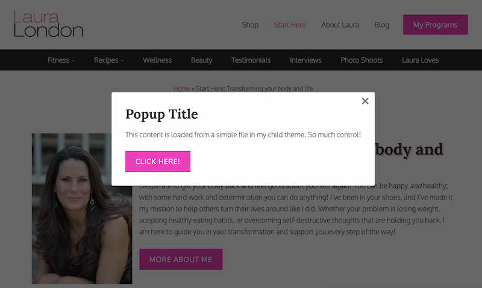

# Wampum Popups
A lightweight developer-based popups WordPress plugin utilizing [oiubounce](https://github.com/carlsednaoui/ouibounce).
* Use a simple function to create 1 or more popups (or slideups) throughout your website
* Various options allow fine-tuning
* Content template system allows clean and efficient loading of popup content
* Easy plugin updates in the WordPress Dashboard via [GitHub Updater plugin](https://github.com/afragen/github-updater)




## Basic Usage
1. TBD
1. Tip: A browser extention like [Cookie Inspector](https://chrome.google.com/webstore/detail/cookie-inspector/jgbbilmfbammlbbhmmgaagdkbkepnijn) is helpful as it lets you manually clear individual cookies 1 at a time

```
wampum_popup( $content, $args );
```

### Shortcode in WP
```
[wampum_popup type="timed" style=modal time=500]
<h2>This is something amazing</h2>
<p>Do this or that thing!</p>
<p><a class="button" href="#">Click Here</a></p>
[/wampum_popup]
```

### Example with default settings

```
$args = array(
	'css'  	=> true, 	// whether or not to load the stylesheet
	'style'	=> 'modal', // 'modal' or 'slideup'
	'time'	=> '4000',  // time in milliseconds
	'type' 	=> 'exit',  // 'exit' or 'timed'
);
wampum_popup( '<p>My popup content here</p>', $args );
```

### Example showing the ability to use multiple/different popups on the same site. (Please don't be annoying!)

```
$args = array(
	'style'			=> 'slideup', 	// 'modal' or 'slideup'
	'time'			=> '4000',  	// time in milliseconds
	'type'			=> 'timed',  	// 'exit' or 'timed'
	'cookieName'	=> 'customCookieName_2',
);
wampum_popup( '<p>My popup content here</p>', $args );
```

## Full example

```
add_action( 'wampum_popups', 'prefix_do_wampum_popup' );
function prefix_do_wampum_popup() {
	// Bail if not a single post
	if ( ! is_singular('post') ) {
		return;
	}
	$args = array(
		'style'			=> 'modal',
		'type'			=> 'exit',
		'cookieName'	=> 'prefixCustomCookiePosts',
	);
    wampum_popup( prefix_get_popup_content(), $options, $args );
}

function prefix_get_popup_content() {
	$output = '';
	$output .= '<h2>This is the headline</h2>';
	$output .= '<p>My popup content here</p>';
	$output .= '<p><a class="button" href="https://bizbudding.com">Click Here</a></p>';
	return $output;
}
```